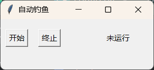

# 这是什么？

    一个幻塔的自动钓鱼脚本，过年期间瞎搞的简单东西，比较粗糙简陋

    程序细节就不多说了，在每个文件里都写得极其细致，而且总共也没多少东西

    请稍微花两分钟看完下面的全部内容

# 程序界面

从 main 文件启动，你就看到这样一个用极其简单的 tk 搓出来的一个界面

单击“开始”，显示“运行中”，这时候就已经在运行了，不会有任何其它迹象

你需要的只是启动游戏，找个地方去钓鱼，然后就可以全自动循环开钓了，不过注意鱼饵鱼竿不会自动补充也不会自己更换，请自行处理

而且第一杆最开始需要你自己点一下，算是某种确认，后面就会自己一直点了，直到你自己停下来

停下来还是回到这个界面点“终止”就完事，然后运行停止且窗口也会一起关闭，点右上角 “X” 退出同理（应该是）

# 补充说明

    这个程序没有做什么优化之类的，而且毕竟是 python 跑，所以对性能非常严苛的情境下就不要用了（尽管理论上并没有很耗性能）

    顺带一提，还没经过非常完善的大量测试，所以不知道还有什么问题，目前存在一个问题就是鱼耐力值的文字识别，如果对应区域背景复杂，原生的pytesseract 识别不了的话我也不知道要怎么解决

    （这个东西大概率不会有更新，如果真的有其他人用并且有反馈的话我才会更）

